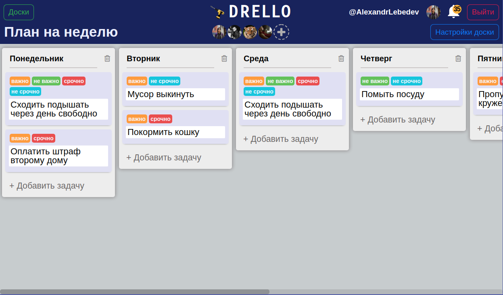
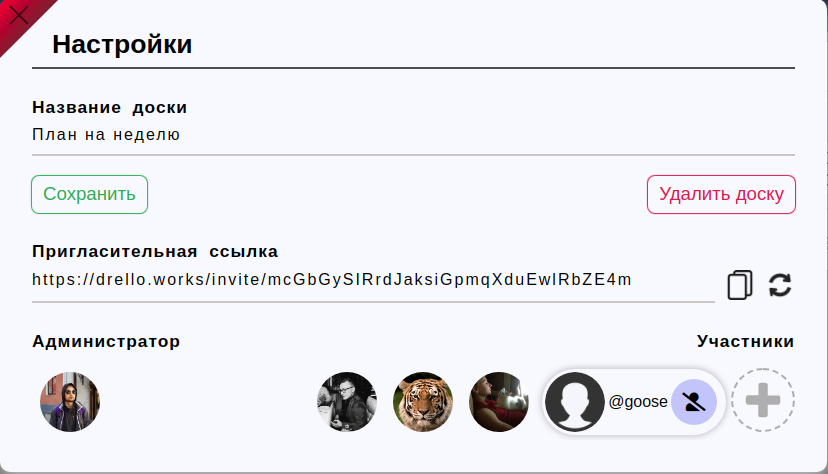
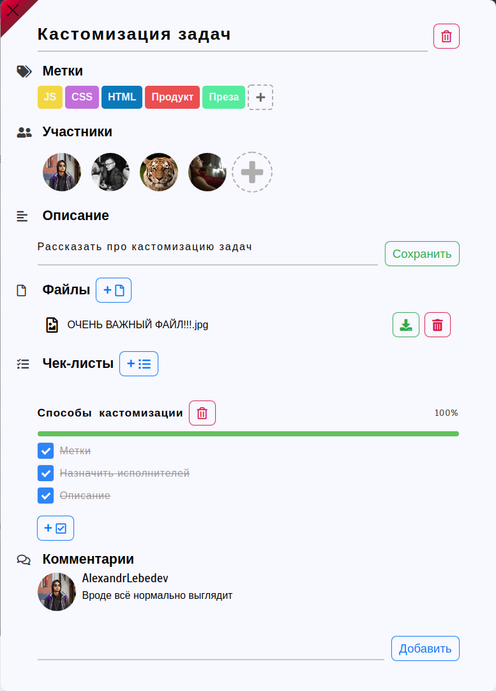
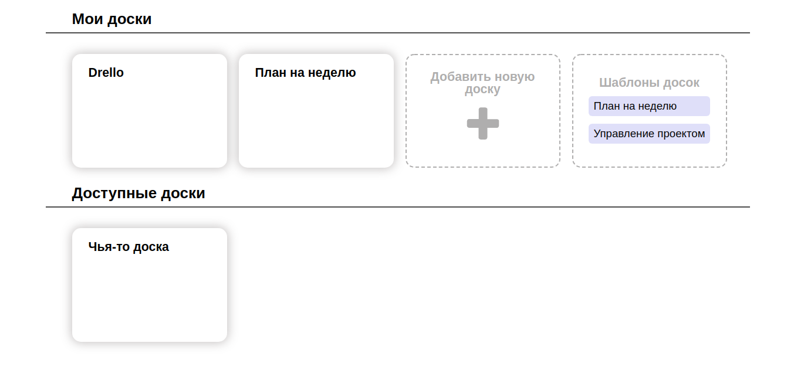

# SIBIRSKAYA KORONA

# Что такое [DRELLO](https://drello.works)?

**[Drello](https://drello.works)** - это многофункциональный таск менеджер, который поможет Вам планировать свои дела, или контролировать процесс командной разработки.
 

## Создавайте доски
Добавляйте колонки и задачи для организации своей доски

##Изменяйте настройки доски
Меняйте название, приглашайте и удаляйте людей из вашей доски.
Вы также можете пригласить людей по **инвайт-ссылке**!

##Кастомизируйте ваши задачи!
- Визуально выделяйте  те или иные задачи среди других с помощью меток
- Назначайте ответственных за выполнение задачи людей
- Раскрывайте подробности в описании или с помощью чек-листов
- Добавляйте связанные с задачей файлы и комментарии

##Просматривайте личные и достпные вам доски
Всё просто!

"Мои доски" - доски, в которых вы администратор
"Доступные доски" - доски, в которых вы участник

# Команда

- [Гариленко Роман](https://github.com/gavroman)
- [Разумов Тимофей](https://github.com/TimRazumov)
- [Четверов Антон](https://github.com/chtvrv) 
- [Лебедев Александр](https://github.com/CheerfulMushroom)

# Менторы
- [Павел Пупчин](https://github.com/4taa)
- [Артем Бакулев](https://github.com/artbakulev)

## Ссылка на проект
- [Drello](http://89.208.197.150:5757)

## Репозиторий бекенда
- [Бекенд](https://github.com/go-park-mail-ru/2020_1_SIBIRSKAYA_KORONA/)

## Репозиторий фронтенда
- Ты уже тут, дурашка :3

## Запуск

- Запустить development сервер с автообновлением на порту `5555`
  
`npm start` или `npm run dev`

- Запустить production сервер на порту `80`
  
`sudo npm run prod` 
 
Минифицированный bundle и css, полифилы
